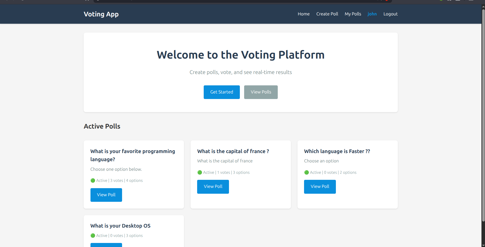
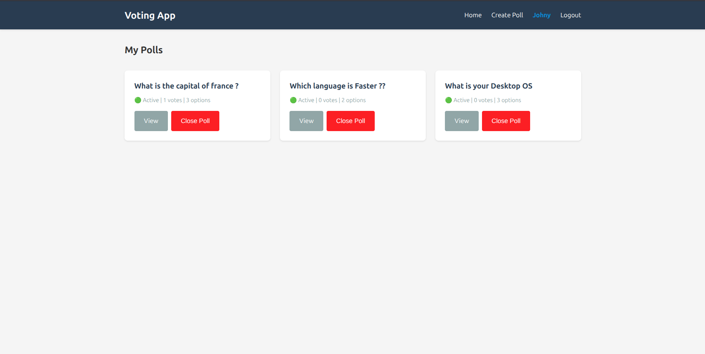
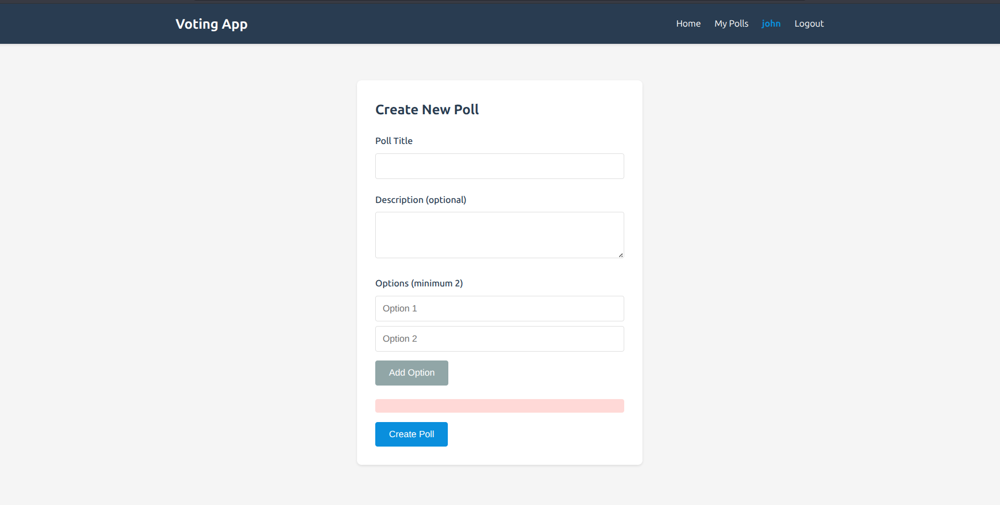
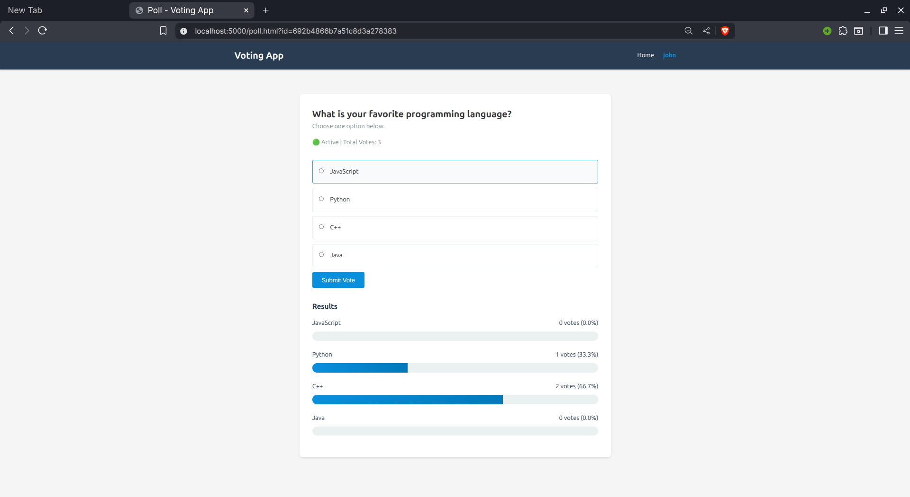

# 🗳️ Voting App

A full-stack web application for creating and managing polls with real-time voting capabilities. Built with Node.js, Express, MongoDB, and vanilla JavaScript.

## 📸 Screenshots

### Home Page


### Poll View


### Create Poll


### Vote Poll


## ✨ Features

- 🔐 **User Authentication** - Secure registration and login with JWT
- 📊 **Create Polls** - Create custom polls with multiple options
- 🗳️ **Vote** - Cast votes on active polls
- 📈 **Real-time Results** - View live poll results with progress bars
- 👤 **Poll Management** - Manage your own polls (close/view)
- 🎨 **Responsive Design** - Works on desktop and mobile devices
- ✅ **Vote Validation** - Prevents duplicate voting

## 🛠️ Technologies Used

### Backend
- Node.js
- Express.js
- MongoDB with Mongoose
- JSON Web Tokens (JWT)
- bcrypt.js for password hashing

### Frontend
- HTML5
- CSS3
- Vanilla JavaScript
- Fetch API

## 📋 Prerequisites

Before you begin, ensure you have the following installed:
- [Node.js](https://nodejs.org/) (v14 or higher)
- [MongoDB](https://www.mongodb.com/) (local or Atlas account)
- npm or yarn

## 🚀 Installation

1. **Clone the repository**
   ```bash
   git clone https://github.com/mahatabul/VotingApp.git
   cd VotingApp
   ```

2. **Install dependencies**
   ```bash
   npm install
   ```

3. **Set up environment variables**
   
   Create a `.env` file in the root directory:
   ```env
   MONGO_URI=your_mongodb_connection_string
   JWT_SECRET=your_jwt_secret_key
   JWT_LIFETIME=30d
   PORT=5000
   ```

4. **Start the server**
   ```bash
   npm start
   ```
   
   For development with auto-restart:
   ```bash
   npm run dev
   ```

5. **Access the application**
   
   Open your browser and navigate to:
   ```
   http://localhost:5000
   ```

## 📁 Project Structure

```
voting-app/
├── controller/
│   ├── auth.js          # Authentication controllers
│   └── polls.js         # Poll controllers
├── db/
│   └── connect.js       # Database connection
├── errors/
│   ├── BadRequest.js
│   ├── custom-error.js
│   ├── index.js
│   ├── not-found.js
│   └── unauthentication.js
├── middleware/
│   ├── authentication.js    # JWT authentication middleware
│   └── errorhandler.js      # Global error handler
├── models/
│   ├── Polls.js         # Poll schema
│   └── Voter.js         # User schema
├── routes/
│   ├── auth.js          # Authentication routes
│   └── polls.js         # Poll routes
├── frontend/
│   ├── index.html       # Home page
│   ├── login.html       # Login page
│   ├── register.html    # Registration page
│   ├── create.html      # Create poll page
│   ├── poll.html        # Individual poll view
│   ├── admin.html       # User's polls dashboard
│   ├── api.js           # API helper functions
│   ├── app.js           # Main frontend logic
│   └── style.css        # Styling
├── .env                 # Environment variables
├── app.js               # Main application file
├── package.json
└── README.md
```

## 🔌 API Endpoints

### Authentication Routes

| Method | Endpoint | Description | Auth Required |
|--------|----------|-------------|---------------|
| POST | `/api/v1/auth/register` | Register new user | No |
| POST | `/api/v1/auth/login` | Login user | No |
| GET | `/api/v1/auth/getPolls` | Get user's created polls | Yes |
| GET | `/api/v1/auth/getPolls/:id` | Get specific user poll | Yes |
| PATCH | `/api/v1/auth/getPolls/:id/closePoll` | Close a poll | Yes |

### Poll Routes

| Method | Endpoint | Description | Auth Required |
|--------|----------|-------------|---------------|
| GET | `/api/v1/polls` | Get all polls | No |
| GET | `/api/v1/polls/:id` | Get specific poll | No |
| POST | `/api/v1/polls/create` | Create new poll | Yes |
| POST | `/api/v1/polls/:id/vote` | Vote on a poll | Yes |

## 📝 Usage Examples

### Register a New User

```javascript
POST /api/v1/auth/register
Content-Type: application/json

{
  "name": "johndoe",
  "email": "john@example.com",
  "password": "securepassword"
}
```

### Create a Poll

```javascript
POST /api/v1/polls/create
Authorization: Bearer <token>
Content-Type: application/json

{
  "title": "Favorite Programming Language",
  "description": "Vote for your favorite language",
  "options": ["JavaScript", "Python", "Java", "Go"]
}
```

### Vote on a Poll

```javascript
POST /api/v1/polls/:id/vote
Authorization: Bearer <token>
Content-Type: application/json

{
  "optionIDX": 0
}
```

## 🎯 Features in Detail

### User Authentication
- Secure password hashing with bcrypt
- JWT-based session management
- Protected routes requiring authentication

### Poll Creation
- Minimum 2 options required
- Optional description field
- Automatic creator tracking

### Voting System
- One vote per user per poll
- Vote validation and duplicate prevention
- Real-time result updates

### Poll Management
- View all created polls
- Close polls to stop voting
- View vote counts and percentages

## 🔒 Security Features

- Password hashing with bcrypt
- JWT token authentication
- Protected API routes
- Input validation
- MongoDB injection prevention

## 🤝 Contributing

Contributions are welcome! Please follow these steps:

1. Fork the repository
2. Create a new branch (`git checkout -b feature/YourFeature`)
3. Commit your changes (`git commit -m 'Add some feature'`)
4. Push to the branch (`git push origin feature/YourFeature`)
5. Open a Pull Request

## 📄 License

This project is licensed under the MIT License - see the [LICENSE](LICENSE) file for details.

## 👤 Author

**Mahatabul Islam**
- GitHub: [@mahatabul](https://github.com/mahatabul)
- Email: rozinislam2002@gmail.com

## 🙏 Acknowledgments

- Express.js documentation
- MongoDB documentation
- JWT best practices
- Node.js community


⭐ If you found this project helpful, please give it a star!

## 🐛 Known Issues

- None at the moment

## 📮 Support

For support, email rozinislam2002@gmail.com or open an issue in the GitHub repository.
